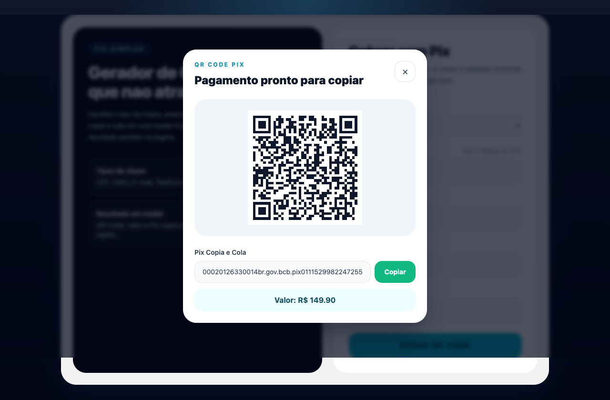

# QR Code Pix Generator

Gerador simples de QR Code Pix com selecao explicita do tipo de chave, validacao basica por tipo e resultado em modal com `Pix Copia e Cola`.



## O que faz

- suporta chaves `CPF`, `CNPJ`, `E-mail`, `Telefone` e `Aleatoria`
- valida a chave antes de gerar o payload
- mostra o QR Code em uma modal
- permite copiar o codigo Pix gerado

## Como rodar

Como o projeto e estatico, basta servir a pasta:

```bash
python3 -m http.server 4173
```

Depois abra:

```text
http://127.0.0.1:4173
```

## Testes

```bash
npm test
```

## Estrutura

- `index.html`: interface
- `script.js`: payload Pix, validacao e integracao com a UI
- `tests/pix.test.js`: testes automatizados da logica principal
